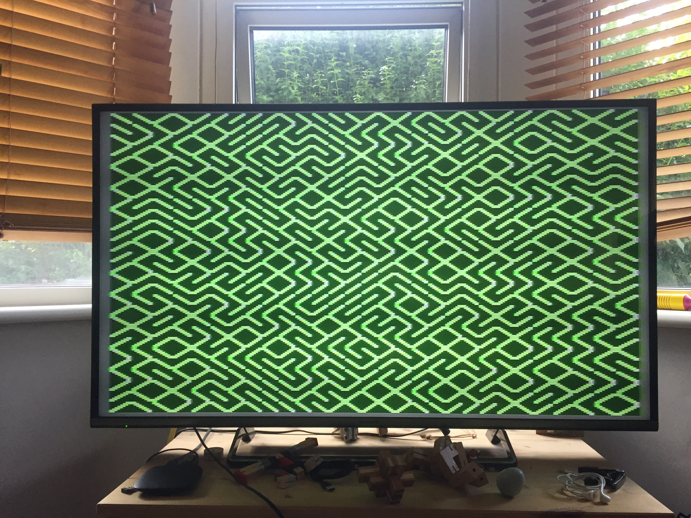
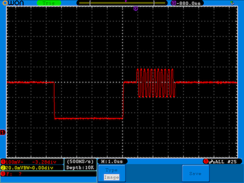
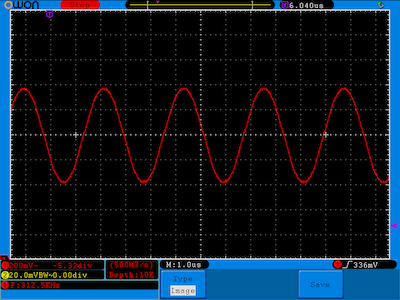
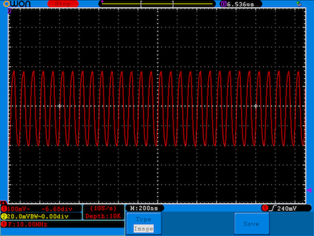
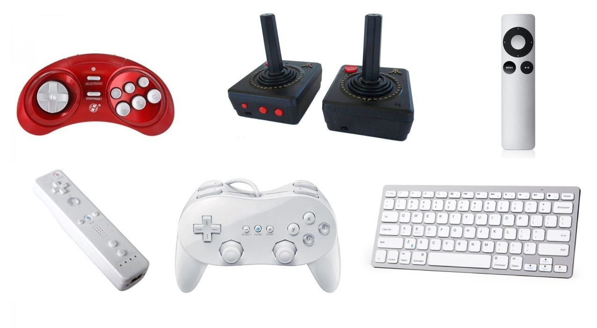

# Read this first than the README

[](https://www.youtube.com/watch?v=V1CWwLJ93Tg)

> *Before you begin*: This is a hack on top of another hack. I don't blame you if you don't want to navigate double pointers (literally, `uint8_t**`). Check [the file `src/gui.c`](https://github.com/murilopolese/RTP_SFPC_SUMMER20/blob/master/arduino/esp_8_bit/src/gui.cpp#L487-L692) and search for `random_characters` to find where in the I put my code. If you only look at that is not that horrible. Good luck, have fun!

# **ESP_8_BIT:** Atari 8 bit computers, NES and SMS game consoles on your TV with nothing more than a ESP32 and a sense of nostalgia
## Supports NTSC/PAL color composite video output, Bluetooth Classic or IR keyboards and joysticks; just the thing when we could all use a little distraction


**ESP_8_BIT** is designed to run on the ESP32 within the Arduino IDE framework. See it in action on [Youtube](https://www.youtube.com/watch?v=qFRkfeuTUrU). Schematic is pretty simple:

```
    -----------
    |         |
    |      25 |------------------> video out
    |         |
    |      18 |---/\/\/\/----|---> audio out
    |         |     1k       |
    |         |             ---
    |  ESP32  |             --- 10nf
    |         |              |
    |         |              v gnd
    |         |
    |         |     3.3v <--+-+   IR Receiver
    |         |      gnd <--|  )  TSOP4838 etc.
    |       0 |-------------+-+   (Optional)
    -----------

```
Audio is on pin 18 by default but can be remapped.

Before you compile the sketch you have 2 choices:
```
//  Choose one of the video standards: PAL, NTSC
#define VIDEO_STANDARD NTSC

//  Choose one of the following emulators: EMU_NES,EMU_SMS, EMU_ATARI
#define EMULATOR EMU_ATARI
```
Build and run the sketch and connect to an old-timey composite input. The first time the sketch runs in will auto-populate the file system with a selection of fine old and new homebrew games and demos. This process only happens once and takes about ~20 seconds so don't be frightened by the black screen.

# The Emulated

## Atari 400/800, XL, XEGS, 5200
Oh how I adore thee Atari 8 bit. 40 years on your cheery blue default background color and enigmatically wiggly built-in font still delights me. Your bizarre industrial design and [giant floppy drives](https://hackaday.com/2015/11/03/minituarizing-the-atari-disk-drive/) are the stuff of legend. Nice to see you back in this new incarnation.

Atari support is built from the venerable Atari800 emulator. Some violence was done to move structures and tables into read-only flash. It does not support machines with 128k RAM.

Enter/Exit GUI with F1. In GUI, '1' or '2' keys insert a disk (**.atr** file) into drives 1 or 2. A '0' key ejects the disk. Shift + Enter will insert Basic along with the selected disk. A 'filename.cfg' file can be used to override default settings. i.e.
miner2049er.bin.cfg (for miner2049er.bin) would look like
```
-5200 -ntsc -cart-type 4 -cart
```
File system is mounted as the "H1" device. See https://atari800.github.io/ for more details.

| Keyboard | Atari |
| ---------- | ----------- |
| Arrow Keys | Joystick 1 |
| Left Shift | Fire Button |
| F1 | Open/Close GUI |
| F2 | Option |
| F3 | Select |
| F4 | Start |
| F5 | Warm Reset |
| Shift+F5 | Cold Reset |
| F6 | Help (XL/XE) |
| F7 | Break |

| Keyboard | Atari 5200 |
| ---------- | ----------- |
| S Key | Start |
| P Key | Pause |
| R Key | Reset |

| WiiMote (sideways) | Atari |
| ---------- | ----------- |
| D-Pad | Joysticks |
| A,B,1,2 | Fire Buttons |
| Home | GUI |
| Minus | Select |
| Plus | Start |
| Plus & Minus Together | Warm Reset |

## Nintendo Entertainment System
Based on [nofrendo](http://www.baisoku.org/).

| Keyboard | NES |
| ---------- | ----------- |
| Arrow Keys | D-Pad |
| Left Shift | Button A |
| Option | Button B |
| Return | Start |
| Tab | Select |

| WiiMote (sideways) | NES |
| ---------- | ----------- |
| Plus | Start |
| Minus | Select |
| A,1 | Button A |
| B,2 | Button B |
| Plus & Minus Together | Reset |

## Sega Master System, Game Gear
Based on [smsplus](https://www.bannister.org/software/sms.htm). Plays **.sms** (Sega Master System) and **.gg** (Game Gear) ROMs. Game Gear titles look a little funny in the middle of the screen, but Shinobi is still a masterpiece.

This is the same emulator with which the brilliant and prolific [SpriteTM](https://esp32.com/viewtopic.php?f=2&t=53) first demostrated the power of the ESP31. [Jeroen](http://spritesmods.com/) is the person most responsible for making the ESP32 ecosystem a pleasure to work with.

| Keyboard | SMS |
| ---------- | ----------- |
| Arrow Keys | D-Pad |
| Left Shift | Button 1 |
| Option | Button 2 |
| Return | Start |
| Tab | Select |

| WiiMote (sideways) | SMS |
| ---------- | ----------- |
| A,1 | Button 1 |
| B,2 | Button 2 |
| Home | GUI |
| Minus | Pause |
| Plus | Start |
| Plus & Minus Together | Reset |

# How it works

## Composite Video
Much as been written on generating color composite video with microcontrollers. [Rickard Gunée](https://elinux.org/images/e/eb/Howtocolor.pdf) kicked it off in 2003, with many fun variants emerging over the years. I enjoyed building the [RBox](https://hackaday.com/2010/10/27/smallest-gaming-console-ever-ever/) in 2010 that used a Cortex M0 and a R2R DAC to generate color NTSC, then in 2015 the [Arduinocade](https://hackaday.com/2015/09/17/retro-games-on-arduinocade-just-shouldnt-be-possible/) on an Arduino with upgraded crystal that used its SPI port to create the colors. Now that 2020 has given us all a little extra time at home its time to do another one.

Now that we have fancy devices like the ESP8266/ESP32 we can be a little more ambitious. We have an order of magnitude more compute, two orders of magnitude more RAM, and three orders of magnitude more storage than an Arduino. And we have lots of new exotic new peripherals to play with. Using this newfound power [CNLohr](https://hackaday.com/2016/03/01/color-tv-broadcasts-are-esp8266s-newest-trick/) pulled off an amazing 1-bit Nyquist folding trick to produce a color NTSC broadcast on an ESP8266. [Bitluni](https://bitluni.net/esp32-color-pal) clocked the ESP32's DAC up to 13.3333Mhz and manged to create color PAL. Bitluni overview of how PAL works, his online visualization tools, his findings from spelunking around in the ESP32, and his other great projects are really worth exploring.

The principle figure of merit for generating nice looking PAL or NTSC color is the accuracy and stability of the synthesized color carrier. Bitluni's clever technique used DDS to produce PAL carrier with ~3 DAC samples per cycle - close enough for most TVs to lock. Phase Alternate Line helps a lot here.

NTSC is a lot more fussy about phase stability, jitter and frequency of its color carrier. DAC + DDS at 13.33Mhz produces a beautiful looking waveform but very sketchy color if any on most TVs.

Turns out the ESP32 has a great tool for creating rock solid color carriers: The **Audio Phase Locked Loop**.

### The magic of the Audio PLL
The ESP32 has a ultra-low-noise fractional-N PLL. It can be tuned to produce DAC sample rates up to **~20Mhz with very accurate frequency control**:


*Fig.1 Audio PLL formula permits precise control over DAC frequency*

Its intended use is to be able to synchronize audio sources running at slightly different frequencies but is just the thing for creating accurate color carriers.

| Standard | (Carrier Frequency)*4 | APLL Frequency |
| ---------- | ----------- | ----------- |
| NTSC | 14.318182Mhz | 14.318180Mhz |
| PAL | 17.734475Mhz | 17.734476Mhz |

As you can see the APLL frequencies can be tuned to be incredibly close to the desired frequencies. Now we have a DAC running at an integer multiple of the color carrier we are off to the races with stable color on NTSC and PAL. From this point it is easy to construct color palettes that map indexed color to carrier phases / amplitudes.



*Fig.1 NTSC Sync and Colorburst*

The APLL is great for lots of other applications. It gives you considerably more headroom above 13.33Mhz - 20Mhz is rock solid, lots of potential for DDS/RF etc.



*Fig.2 64 step DDS sinewave from DAC driven at 20Mhz*



*Fig.3 20Mhz DAC output still looks nice and clean*

### No Free Lunch
Exciting though it is, the APLL has one drawback. It seems that if you use a non integer denominator (`sdm1 != 0 || smd2 != 0`) in the APLL settings at high frequencies there seems to be a clock domain conflict between the DAC and I2S. If you split the DACs and try to use the `I2S_CONF_SINGLE_DATA_REG` to write audio samples to the other DAC channel this conflict manifests as dropouts in both DAC outputs. I would love to know what is going on here: It might have something to do with running the DAC way out of spec. Perhaps someone at Espressif will take pity on me an let me know.

APLL / DAC video looks great but it appears we need another source of audio besides the second DAC channel.

## Making noises - lots of options
There are a lot of different options to create sound with an ESP32 besides the DAC. I2S1, SPI, PWM ....

### PDM
If you want to build a high quality 1-bit DAC then Pulse Density Modulation is a great choice. The ESP32 I2S0 hardware has one built-in, unfortunately we are using I2S0 for video. It is fast/easy to do your own modulation and send it out any high speed digital channel: SPI with DMA, bitbanging gpio etc. Using both SPI ports would give you stereo.

[Jan Ostman](https://www.hackster.io/janost/audio-hacking-on-the-esp8266-fa9464) has done some lovely work on this on microcontrollers large and small. Also check out [Super Audio CD](https://en.wikipedia.org/wiki/Super_Audio_CD) that used PDM right before people gave up on the idea of physical media.
PDM is used in digital mems microphones and is a great way of attaching lots of microphones to microcontrollers. You could easily attach 8 of them to a gpio port on a ESP32 and build a nice 3D beamforming microphone: just add a few CIC filters and a little [delay-and-sum](http://www.labbookpages.co.uk/audio/beamforming/delaySum.html) and off you go.

### PWM
PWM is really a special case of PDM. It does not do a great job of shaping noise but for our purposes it is really convenient. With up to 16 outputs from the LED PWM hardware stereo would be no problem and it only takes a couple of lines of code to get it going. Its limited dynamic range is more than enough to reproduce those classic sounds from the 80's.

You will want to add a simple rc filter to the output pin of either PWM or PDM to avoid becoming a tiny radio station and interfering with the nice video are producing.

## Bringing it Together

The audio/video system uses a double buffered I2S DMA to send video data line by line to the DAC. The interrupt keeps time at the line rate (15720hz for NTSC, 15600hz for PAL). A single audio sample is fed to the LED PWM and a single line of video is converted from index color to phase/amplitude at each interrupt. The IR input pin is scanned and the various IR state machines advanced on changes.

This a/v pump is fed by the emulator running asynchronously producing frames of video and audio. The emulator may be running on a different core and may occasionally take longer than a frame time to produce a frame (SPI paging / FS etc). The interrupt driven pump won't care, it just keeps emitting the last frame.

## Bluetooth Classic HID

As of this writing the ESP32 IDF / Arduino does not support Bluetooth Classic input devices out of the box. **ESP_8_BIT** includes a minimal HCI/L2CAP/HID stack implemented on top of the VHCI api. This `hid_server` implementation is designed to support EDR Keyboards, WiiMotes and their peripherals. The implementation is bare bones but supports paring/reconnections and is easily separable to be used in other projects.

## Big Cartridges

How do you fit a 512k game cartridge into a device that has 384k of RAM, nearly all of which is consumed with screen buffers and emulator memory?

Short answer is you don't. When a large cart is selected it gets copied into `CrapFS`; an aptly named simple filesystem that takes over the `app1` partition at first boot. One copied `CrapFS` uses `esp_partition_mmap()` to map the part of the partition occupied by the cartridge into the data space of the CPU.

> We are using an Audio PLL to create color composite video and a LED PWM peripheral to make the audio, a Bluetooth radio or a single GPIO pin for the joysticks and keyboard, and gpio for the IR even though there is a perfectly good peripheral for that. We are using virtual memory on a microcontroller. And it all fits on a single core. Oh how I love the ESP32.


# Keyboards & Controllers
**ESP_8_BIT** supports Bluetooth Classic/EDR keyboards and WiiMotes along with an variety of IR keyboards and joysticks.

**On boot the software searches for new Bluetooth devices for 5 seconds**; if the device is in pairing mode the software should find it and display its name at the bottom of the screen. Some keyboards will require you to enter a "0000" to establish the connection the first time. WiiMotes should automatically pair and reconnect. WiiMote Classic controllers are also supported.



A number of IR input devices are supported if to add a optional IR receiver (TSOP38238, TSOP4838 or equivalent) to pin 0. The IR Wireless Controllers from Atari Flashback 4 work well and have that classic Atari joystick feel. Retron IR controllers are supported as are WebTV keyboards that come in various guises: WebTV, MsnTV, Displayer, UltimateTV etc. They all should work just fine. A few places have the nice Philips variant new for $11.95 w/ free shipping (search for 'SWK-8630'). If you made a [ZorkDuino](https://hackaday.com/2014/04/30/the-zorkduino/) you will have one of these.

# Time to Play

If you would like to upload your own media copy them into the appropriate subfolder named for each of the emulators in the data folder. Note that the SPIFFS filesystem is fussy about filenames, keep them short, no spaces allowed. Use '[ESP32 Sketch Data Upload](https://randomnerdtutorials.com/install-esp32-filesystem-uploader-arduino-ide/)' from the 'Tools' menu to copy a prepared data folder to ESP32.

Play through the included demos. Load up your own. Write some Atari Basic masterpiece. Type in a game from an old Antic magazine. Finally get around to finishing Zork.

Enjoy,

rossum
